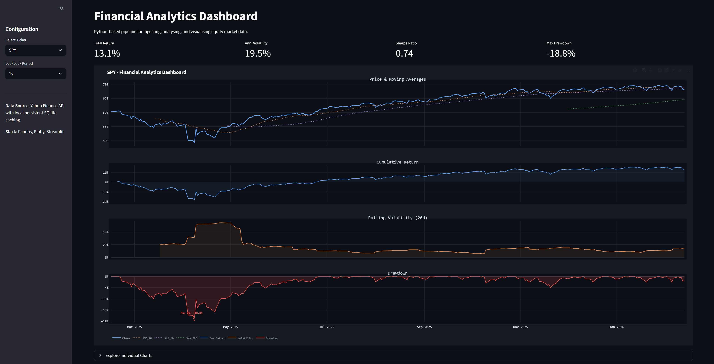
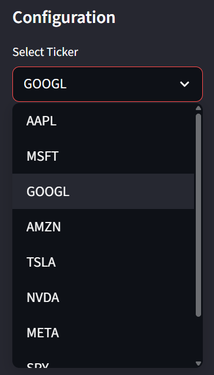
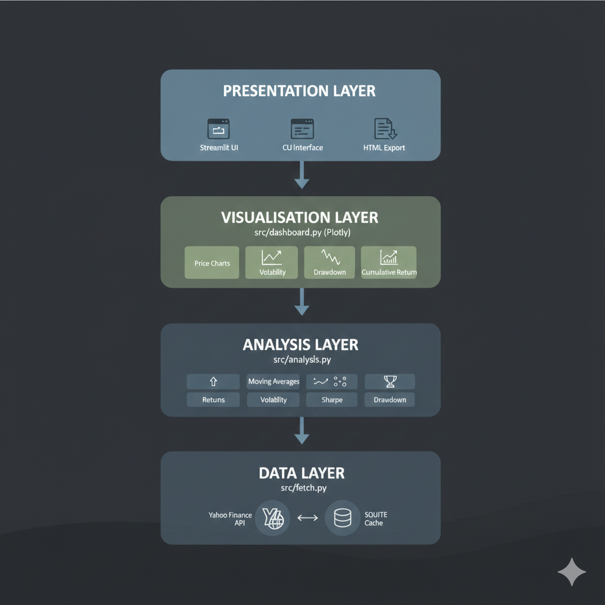

# Market Analytics Platform

[](https://python.org)
[](https://streamlit.io)
[](LICENSE)

A professional-grade financial analytics dashboard for equity market analysis. Built with Python, featuring interactive visualisations, real-time data ingestion, intelligent caching, and comprehensive risk metrics.



---

## Features

**Interactive Dashboard**
- Real-time ticker switching across major US equities (AAPL, MSFT, GOOGL, AMZN, TSLA, NVDA, META, SPY, QQQ)
- Configurable lookback periods (3 months to max history)
- Professional dark theme inspired by Bloomberg Terminal

**Financial Metrics**
- Total & Annualised Returns (CAGR)
- Rolling Volatility (20-day annualised)
- Sharpe Ratio (risk-adjusted performance)
- Maximum Drawdown with peak annotation
- Moving Averages (SMA 20, 50, 200)

**Three Operating Modes**
- **Streamlit Dashboard:** Full interactive web UI
- **CLI Analysis:** Quick terminal-based summary statistics
- **HTML Export:** Standalone shareable dashboard files

**🗄️ Intelligent Caching**
- SQLite-based persistent cache
- 6-hour automatic expiry
- Smart coverage detection (cached 1y data serves 3mo requests)
- Offline capability for previously fetched data

---

## Dashboard Preview

### Main Dashboard View
Four-panel layout showing price action, cumulative returns, rolling volatility, and drawdown analysis.


### Multi-Stock Analysis
Analyse any major equity with consistent metrics and visualisation.


### Individual Chart Exploration
Drill down into specific metrics with interactive Plotly charts.

| Cumulative Return | Volatility | Drawdown |
|-------------------|------------|----------|
|  |  |  |

### Flexible Configuration
Switch tickers and timeframes instantly.

| Ticker Selection | Period Selection |
|------------------|------------------|
|  |  |

---

## Technical Architecture


The application follows a clean **four-layer architecture** with clear separation of concerns:

<p align="center">
  
</p>


### Design Principles

- **Separation of Concerns** Data, analysis, and visualisation are fully decoupled
- **Cache-First Architecture** Minimises API calls, improves reliability
- **Type Safety** Full type hints throughout for clarity and IDE support
- **Comprehensive Testing** pytest suite with edge case coverage
- **Structured Logging** Debug-friendly logging throughout

---

## Installation

### Prerequisites
- Python 3.9 or higher
- pip package manager

### Setup

```bash
# Clone the repository
git clone https://github.com/KyleWareEng/market-analytics-platform.git
cd market-analytics-platform

# Create virtual environment
python -m venv env
source env/bin/activate  # Windows: .\env\Scripts\activate

# Install dependencies
pip install -r requirements.txt
```

---

## Usage

### 1. Interactive Dashboard (Default)

```bash
python main.py
# Opens browser at http://localhost:8501
```

Or run directly:

```bash
streamlit run src/dashboard.py
```

### 2. CLI Analysis

```bash
python main.py --ticker TSLA --period 2y
```

**Output:**
```
==================================================
  TSLA - Summary Statistics (2y)
==================================================
  total_return                      45.23%
  annualized_return                 20.15%
  annualized_volatility             45.67%
  sharpe_ratio                      0.4412
  max_drawdown                     -35.12%
  best_day                           8.45%
  worst_day                         -9.12%
  trading_days                         504
==================================================
```

### 3. Export HTML Dashboard

```bash
python main.py --ticker AAPL --period 1y --export
# Creates: data/AAPL_dashboard.html
```

### 4. Programmatic Use

```python
from src.fetch import fetch_price_data
from src.analysis import compute_summary_stats
from src.dashboard import build_dashboard

# Fetch data
df = fetch_price_data("MSFT", period="1y")
prices = df["Close"]

# Compute metrics
stats = compute_summary_stats(prices)
print(f"Sharpe Ratio: {stats['sharpe_ratio']:.2f}")

# Generate chart
fig = build_dashboard(prices, "MSFT")
fig.show()
```

---

## Project Structure

```
market-analytics-platform/
│
├── src/                           # Core application modules
│   ├── __init__.py
│   ├── fetch.py                   # Data ingestion & SQLite caching
│   ├── analysis.py                # Financial computations
│   └── dashboard.py               # Plotly visualisations & Streamlit UI
│
├── tests/                         # Unit test suite
│   ├── __init__.py
│   ├── test_analysis.py           # Comprehensive analysis tests
│   └── test_fetch.py              # Data fetching tests
│
├── images/                        # Dashboard screenshots
│   ├── preview_spy_1y_page1.png
│   ├── preview_googl_1y_page1.png
│   └── ...
│
├── data/                          # Local data storage (gitignored)
│   ├── market_data.db             # SQLite cache database
│   └── *.html                     # Exported dashboards
│
├── main.py                        # Application entry point
├── requirements.txt               # Production dependencies
├── requirements-dev.txt           # Development dependencies
└── README.md
```

---

## Technical Stack

| Category | Technologies |
|----------|-------------|
| **Language** | Python 3.9+ |
| **Data Ingestion** | yfinance, SQLite |
| **Analysis** | Pandas, NumPy |
| **Visualisation** | Plotly |
| **Dashboard** | Streamlit |
| **Testing** | pytest, pytest-mock, coverage |
| **Code Quality** | black, flake8, mypy |

---

## Financial Metrics Explained

| Metric | Formula | Interpretation |
|--------|---------|----------------|
| **Daily Returns** | r_t = (P_t / P_{t-1}) - 1 | Percentage change day-over-day |
| **Cumulative Return** | ∏(1 + r_i) - 1 | Total wealth accumulation |
| **Annualised Volatility** | σ_daily × √252 | Risk measure (higher = more volatile) |
| **Sharpe Ratio** | √252 × (mean_excess / std_excess) | Return per unit of risk (>1 is good, >2 is excellent) |
| **Maximum Drawdown** | (wealth - running_max) / running_max | Worst peak-to-trough decline |

---

## Testing

```bash
# Install dev dependencies
pip install -r requirements-dev.txt

# Run tests
python -m pytest tests/ -v

# Run with coverage
coverage run -m pytest tests/
coverage report
```

### Test Coverage

- **Returns Tests:** Length validation, NaN handling, edge cases
- **Moving Averages Tests:** Default/custom windows, invalid inputs
- **Volatility Tests:** Annualisation scaling, shape consistency
- **Drawdown Tests:** Constraint validation (always ≤ 0), monotonic series
- **Sharpe Ratio Tests:** Positive/negative returns, zero volatility edge case
- **Summary Stats Tests:** Complete key validation, type checking

---

## Sample Results

### SPY (S&P 500 ETF) - 1 Year

| Metric | Value |
|--------|-------|
| Total Return | +13.1% |
| Annualised Volatility | 19.5% |
| Sharpe Ratio | 0.74 |
| Max Drawdown | -18.8% |

### GOOGL (Alphabet) - 1 Year

| Metric | Value |
|--------|-------|
| Total Return | +65.7% |
| Annualised Volatility | 31.0% |
| Sharpe Ratio | 1.79 |
| Max Drawdown | -21.8% |

---

## AI-Augmented Development

This project was built using an **AI-augmented development workflow** to accelerate development and maintain code quality:

- **Platform Antigravity:** Used for initial project scaffolding, architecture decisions, and code generation
- **Claude Code:** Assisted with debugging, refactoring, and implementing complex features
- **Iterative Development:** AI suggestions were reviewed, tested, and refined rather than used verbatim

This approach demonstrates proficiency in leveraging modern AI coding assistants as productivity tools while maintaining understanding and ownership of the codebase. All code was reviewed, tested, and validated to ensure correctness and quality.

---

## What I Learned

Building this project taught me:

- **Software Architecture:** Designing clean, modular systems with separation of concerns
- **Data Engineering:** Implementing caching strategies, database schemas, and API integration
- **Financial Mathematics:** Annualisation, risk-adjusted returns, drawdown analysis
- **Production Python:** Type hints, logging, testing, code quality tools
- **Dashboard Development:** Building professional UIs with Streamlit and Plotly
- **DevOps Basics:** CLI argument parsing, multiple deployment modes, configuration management
- **AI-Augmented Development:** Effectively using AI coding assistants while maintaining code ownership and quality

---

## Future Enhancements

- [ ] Additional metrics: Sortino Ratio, Value at Risk (VaR), Beta
- [ ] Portfolio analysis with correlation matrix
- [ ] Multiple data providers (Alpha Vantage, IEX Cloud)
- [ ] Backtesting framework
- [ ] Docker containerisation
- [ ] Cloud deployment (AWS/GCP)

---

## License

MIT License: see [LICENSE](LICENSE) for details.

---

## Contact

**Kyle Ware**

- Email: kyle.ware@outlook.com
- LinkedIn: [linkedin.com/in/kyleaware](https://linkedin.com/in/kyleaware)
- GitHub: [github.com/KyleWareEng](https://github.com/KyleWareEng)

MEng Automotive Engineering | Data Science & Quantitative Finance

---

*Built with Python, Streamlit & Plotly | February 2026*
